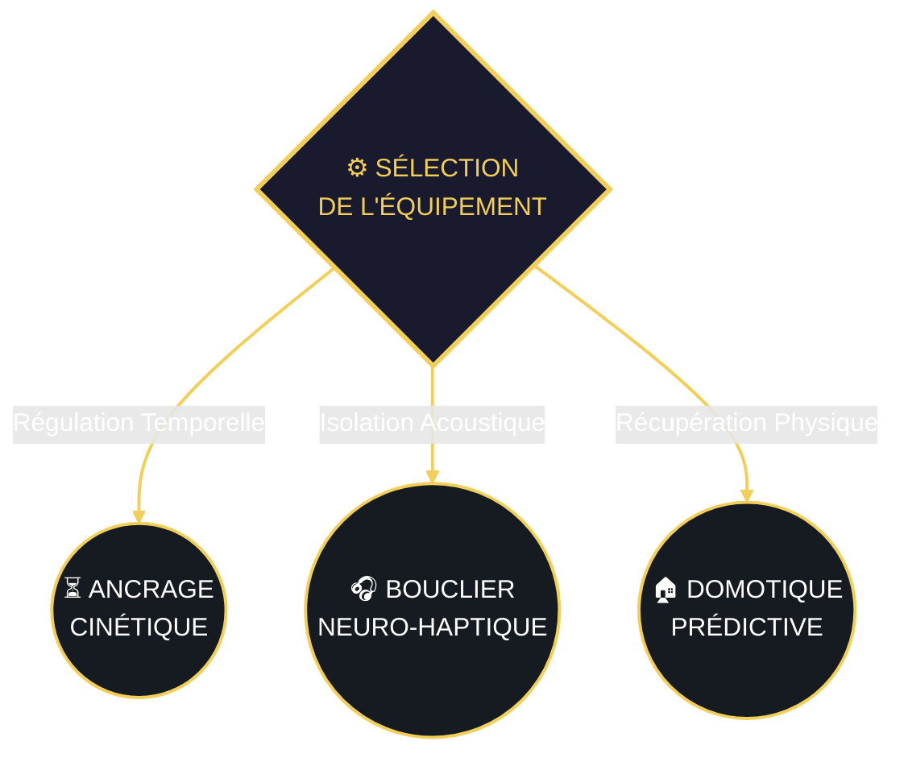

---
cssclasses: moc-armurerie
---

<!-- HEADER MOC -->

 Concepts 💡 Idées 💡 Produits 
🧰 Caisse à Outils 🛠️  
(Neuro-Hardware)
<a href="/index" style="color: #8b949e; text-decoration: none; border: 1px solid #30363d; padding: 5px 15px; border-radius: 5px; font-weight: bold; background: #0d1117; background-image: none !important;">⬆️ Retour Cockpit</a>

<!-- HUD SENSORIEL -->

📡 CHARGE SENSORIELLE 
[ MESURE EN COURS ]

### 🧭 Interface de Déploiement Matériel (VSL Interactive)

*(Graphe de routage : Clique sur les modules pour accéder à l'équipement).*

