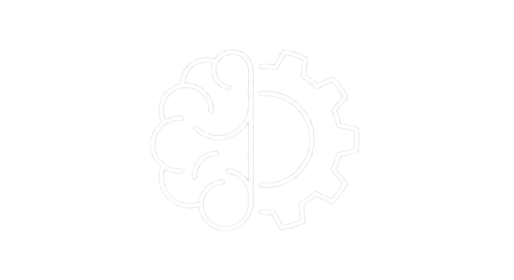

 
<!-- LOGO ORIORIS ANIMÉ --> 

 
<!-- Modifie "logo-orioris.png" par le nom exact de ton image --> 

  <!-- 2. ÉTAT DU SYSTÈME (BARRE VAYNE) -->
  

    

      75% - PHASE CRITIQUE 🚀
    

  

  
  <!-- 3. FREIN D'URGENCE (SOS GYROPHARE) -->
  

    <a href="/🚨Système-Anti-Crash" style="text-decoration: none; display: block; padding: 40px; text-align: center; position: relative;">
      

      

        🚨 SOS : JE CRAQUE
        

          
            ACTION IMMÉDIATE • CASSER LE CRASH
          
        

      

    </a>
  

  
  <!-- 4. ROUTAGE (MOCs) -->
  

    <!-- Carte 1 -->
    <a href="/MOC-pilotage" style="text-decoration: none; background-image: none !important; box-shadow: none !important;">
      

        🌅 LE COCKPIT
        
Piloter ma journée. <small>(Routines & Agendas)</small>

      

    </a>
    <!-- Carte 2 -->
    <a href="/MOC-LABO-IA" style="text-decoration: none; background-image: none !important; box-shadow: none !important;">
      

        ⚙️ LABO IA
        
Aides Techniques Neuroatypie <small>(Analyses & Développement)</small>

      

    </a>
    <!-- Carte 3 -->
    <a href="/MOC-Outils-Strategies" style="text-decoration: none; background-image: none !important; box-shadow: none !important;">
      

        🛒 SHOP
        
Neuro-Équipement. <small>(Standard Orioris)</small>

      

    </a>
    <!-- Carte 4 : Médication -->
    <a href="/MOC-Medication" style="text-decoration: none; background-image: none !important; box-shadow: none !important;">
      

        💊 NEURO-CHIMIE
        
Monitoring de Médication. <small>(Molécule & Logistique)</small>

      

    </a>    
  
  

> [!success] La Philosophie ORIORIS
> **"Ne changez pas de cerveau, équipez-le."**
> Arrêtez d'essayer de "réparer" la neuroatypie pour entrer dans le moule. Nous concevons des exosquelettes cognitifs qui remplacent la volonté défaillante par une structure externe infaillible.

<video autoplay loop muted playsinline poster="/static/photo_cybervideo_008.png" style="width: 100%; border-radius: 8px; margin-top: 20px; box-shadow: 0 0 20px rgba(0, 255, 65, 0.2);"> 
  <source src="/static/Vidéo_Cyberpunk_orioris.mp4" type="video/mp4"> 
</video>

## 🧠 NEUROKIT : Le Système Modulaire
Le NeuroKit n'est pas une méthode monolithique étouffante. C'est un assemblage de briques interchangeables qui s'adaptent en temps réel à l'état de votre système nerveux.

### 🛡️ 1. Le Kit de Survie (Mode Crash)
*Cible : Paralysie décisionnelle, Burnout, Surcharge sensorielle.*
*   **Système 🚨 ANTI-CRASH :** Bouton d'urgence en cas de surcharge ou de "mélodrame".
*   **Système 🔥 ANTI-UP :** Frein de sécurité face à l'excitation ou l'impulsivité.

### ⚡ 2. Le Kit d'Action (Mode Focus)
*Cible : Démarrage impossible, Distraction, Hyperfocus mal dirigé.*
*   **HUD de Vie :** Barres de progression et jauges d'énergie physiques et mentales.
*   **Workflows d'Automatisation :** L'IA prend le relais sur les tâches répétitives.

### 📐 3. Le Kit de Structure (Mode Orga)
*Cible : Phobie administrative, "Oubli" des projets, Perte de fichiers.*
*   **Rituels 🌅 Matin / 🌙 Soir :** Démarrage sans friction et fermeture des boucles mentales pour un sommeil profond.
*   **📥 L'Inbox de Décharge :** Capture des idées parasites en moins de 2 clics pour préserver la mémoire de travail.

---
## 🚀 Obtenir le Système
[Bouton de Téléchargement / Accès au Vault] *(Lien à configurer)*

 📦 <h3 style="color: #f2ce5a; margin-top: 10px; font-weight: 900;">TÉLÉCHARGER LE NEUROKIT</h3> 
Le lien d'accès au Vault Obsidian vous sera envoyé par transmission directe.
 <!-- Formulaire pointant vers ton n8n --> <form action="URL_DE_TON_WEBHOOK_N8N_ICI" method="POST"> <input type="email" name="email" placeholder="Adresse email de réception..." required style="padding: 15px; width: 85%; border-radius: 8px; border: 1px solid #30363d; background: #0d1117; color: white; margin-bottom: 15px; font-family: 'Inter', sans-serif;"> <button type="submit" style="background: #00ff41; color: #000; font-weight: 900; padding: 15px 25px; border: none; border-radius: 8px; cursor: pointer; width: 85%; text-transform: uppercase; letter-spacing: 1px; transition: 0.2s;"> INITIER LE TRANSFERT </button> </form> 

