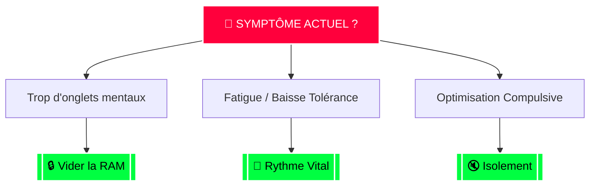

  
  <!-- HEADER MOC -->
  

    🚨 MOC : ANTI-CRASH
    <a href="/index" style="color: #8b949e; text-decoration: none; border: 1px solid #30363d; padding: 5px 15px; border-radius: 5px; font-weight: bold; background-image: none !important;">⬆️ Retour Cockpit</a>
  

  <!-- HUD STATUT IMMÉDIAT -->
  

    

      ⚠️ SURCHARGE MENTALE DÉTECTÉE 
      [ PROTOCOLE ENGAGÉ ]
    

  

### 🧭 Graphe de Décision Spatial

_(Les nœuds verts sont cliquables. Ils te téléportent vers l'action.)_

<!-- GRILLE DE ROUTAGE MANUEL (Redondance) -->

<!-- Carte 1 -->
<a href="/Cloture-Boucles" style="text-decoration: none; background-image: none !important;">

🔒 Vider la RAM

Fermer 1 chose avant d'en ouvrir 3. Tuer les tâches en cours.

</a>
<!-- Carte 2 -->
<a href="/Reduction-Bruit" style="text-decoration: none; background-image: none !important;">

🔇 Isolement

Checklist réduction de bruit. Moins de décisions = Plus d'énergie.

</a>
<!-- Carte 3 -->
<a href="/Protocole-Recuperation" style="text-decoration: none; background-image: none !important;">

🔋 Rythme Vital

Hygiène de base, limites claires, sommeil et pauses.

</a>

