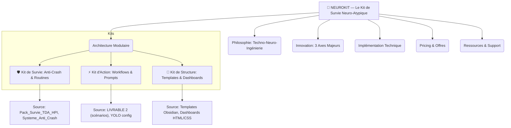
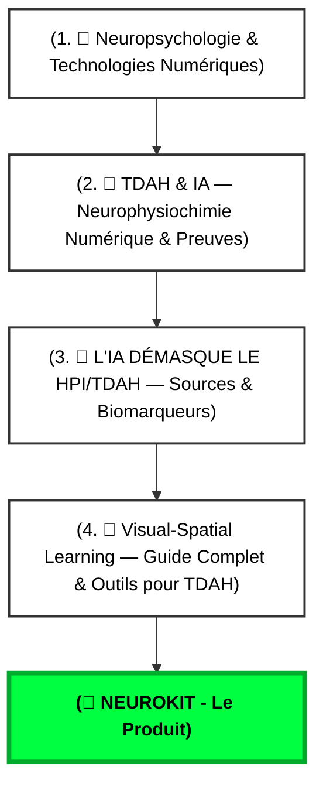

# 🧠 NEUROKIT — Le Kit de Survie Neuro-Atypique

> [!NOTE]🎯 TL;DR : Ton Produit Phare est Né
> NEUROKIT n'est pas "une idée de plus". 
> >  C'est ton **"Produit Minimum Viable"** avec une vision claire.
> 🧊 Phrase d'Ancrage
> "NEUROKIT n'est pas un 'cours' ou un 'livre'. C'est un **système modulaire** qui s'adapte à ton état TDAH. 
> Tu as 3 kits : Survie (quand ça va mal), Action (quand tu as de l'énergie), Structure (quand tu veux t'organiser). 
> Et derrière, une IA qui s'adapte à toi (Neuroadaptive), un environnement 3D (Spatial), et un jeu qui te donne des points (Bio-Feedback). 
> C'est la première fois que quelqu'un assemble tout ça **spécifiquement pour TDAH/HPI**. Pas juste 'des conseils'. Un **système opérationnel**. Et j'ai les preuves scientifiques pour chaque brique."

---

## 1. ⚙️ Philosophie : La Techno-Neuro-Ingénierie

Mantra

"Ne changez pas de cerveau, équipez-le." Ce produit incarne une approche unique : utiliser l'ingénierie des systèmes et l'IA pour créer des prothèses cognitives et des environnements neuro-adaptatifs, spécifiquement conçus pour les cerveaux neuro-atypiques (TDAH/HPI).

---

## 2. 🧱 Architecture Modulaire : Les 3 Kits NEUROKIT

NEUROKIT s'organise en 3 kits distincts, pensés pour s'adapter à l'état cognitif et énergétique de l'utilisateur.

### Détail des Kits :

- **🛡️ Kit de Survie : Routines & Anti-Crash**
    
    - _Objectif :_ Stabiliser quand ça va mal. Gérer les crises, les surcharges, les baisses d'énergie.
    - _Sources existantes :_ `Pack_Survie_TDA_HPI`, `🔥 Système Anti-Up`.
    - _Nouveauté NEUROKIT :_ Regroupe et formalise ces outils existants pour une utilisation claire et immédiate.
- **⚡ Kit d'Action : Workflows & Prompts**
    
    - _Objectif :_ Maximiser l'efficacité quand l'énergie est présente. Lancer des tâches, automatiser, produire du contenu.
    - _Sources existantes :_ `🎯 LIVRABLE 2 — Scénarios & Visuels Avancés Projet TDAH`, configuration YOLO, QuickAdd.
    - _Nouveauté NEUROKIT :_ Organise les prompts et workflows pour une action rapide et ciblée.
- **🧠 Kit de Structure : Templates & Dashboards**
    
    - _Objectif :_ Maintenir l'ordre et la clarté sur le long terme. Organiser les connaissances, suivre les projets.
    - _Sources existantes :_ Templates Obsidian (Daily Log, Project Hub, Brain Dump), Dashboard HTML/CSS (barres de progression), `🧭 Etat des Lieux PC-installation reseau`.
    - _Nouveauté NEUROKIT :_ Fournit les cadres structurants pour un second cerveau organisé.

---

## 3. 💡 Innovation : Les 3 Axes de la "Patrice Touch"

Ces axes représentent les innovations qui différencient NEUROKIT des solutions existantes.

### A. 🤖 Neuroadaptive AI (IA Neuro-Adaptative)

- **Concept :** Une interface IA vivante qui s'adapte en temps réel à ton état cognitif (stress, flow, fatigue) via des biomarqueurs (eye-tracking, EEG).
- **Lien avec ton système :** Implémentation technique des principes de `🧠 L'IA DÉMASQUE LE HPI/TDAH — Sources & Biomarqueurs`.
- **Développement futur :** L'IA adapte ses réponses, son rythme, son niveau de détail en fonction de ton "état".

### B. 🗺️ Spatial Computing & 3D (Environnement Spatial)

- **Concept :** Passer d'Obsidian Canvas (2D) à un environnement 3D/VR, où les notes sont manipulées comme des objets dans un "palais mental virtuel".
- **Lien avec ton système :** Évolution de `🧠 Visual-Spatial Learning — Guide Complet & Outils pour TDAH`.
- **Réalisme :** Commencer par améliorer les plugins 3D pour Canvas, avant d'envisager des casques VR (Tesla.Suit, Apple Vision Pro).

### C. ❤️ Bio-Feedback Gamifié (HUD de Vie)

- **Concept :** Intégrer des métriques de bien-être (niveaux d'énergie, de stress) directement dans ton interface Obsidian, gamifié comme un jeu vidéo (HP/MP).
- **Lien avec ton système :** Utilise ta "propre subjectivité" (charge cognitive 5/5) comme métrique objective.
- **Bénéfice TDAH :** Offre un feedback visuel et immédiat pour l'auto-régulation et la prise de décision.

---

## 4. 🛠️ Implémentation Technique (Comment l'utiliser)

Pour que NEUROKIT soit opérationnel, il s'appuie sur ton écosystème technique.

- **Installation Obsidian :** Fourniture de templates à importer.
- **Configuration YOLO :** Modèles IA recommandés, gestion des modes (Ask, Edit, Full Access).
- **Workflows n8n :** Exports JSON pour les automatisations (ex: veille TDAH).
- **Dashboard :** Code HTML/CSS pour les barres de progression et les vues synthétiques.

---

## 5. 💰 Pricing & Offres (Potentiel Commercial)

NEUROKIT peut se décliner en plusieurs offres :

- **Pack Obsidian NEUROKIT :** 29€ (Templates, Dashboards, Guides d'installation).
- **Formation VSL pour TDAH :** 197€ (Modules vidéo basés sur tes principes VSL).
- **Consulting ORIORIS :** 400-600€/jour (Audit personnalisé, mise en place de systèmes).

---

## 6. 🔗 Ressources & Support

- **Documentation :** Liens vers toutes les notes sources (scientifiques, techniques, méthodologiques).
    - Philosophie : `[[🧠 D O S S I E R N E U R O K I T . F R.md]]` (à créer ou consolider)
    - Architecture : `[[Projet NEUROKIT.md]]` (à créer ou consolider)
    - Sources Scientifiques : `[[🎯 TDAH & IA — Neurophysiochimie Numérique & Preuves]]`
    - Templates : `[[Pack_Survie_TDA_HPI]]`
    - Scénarios : `[[🎯 LIVRABLE 2 — Scénarios & Visuels Avancés Projet TDAH]]`
- **Support :** Discord, email (à mettre en place).
- **Mises à jour :** Changelog régulier.

---

## 7. 🧩 Synergies et Argumentaire Scientifique

Tes notes scientifiques forment un "pilier" argumentaire **imbattable** pour NEUROKIT.

- **Flux logique de lecture (pour un client) :**
    1. `🧠 Neuropsychologie & Technologies Numériques` : "Ok, les technologies sont des prothèses cognitives validées."
    2. `🎯 TDAH & IA — Neurophysiochimie Numérique & Preuves` : "Et maintenant, l'IA agit comme un médicament numérique. Voici les études 2025-2026."
    3. `🧠 L'IA DÉMASQUE LE HPI/TDAH — Sources & Biomarqueurs` : "Mais comment savoir si j'ai vraiment TDAH ? L'IA détecte des biomarqueurs objectifs."
    4. `🧠 Visual-Spatial Learning — Guide Complet & Outils pour TDAH` : "Voici COMMENT implémenter tout ça : les outils VSL, le timing avec le Ritaline, les setups pratiques."
    5. **NEUROKIT :** "Et voici le produit qui rassemble tout ça dans un système opérationnel pour toi !"

---

## 8. ✅ Checklist de Création du Produit NEUROKIT

Ton Plan de Travail Détaillé

### Phase 1 : Structuration (Cette semaine - Février 2026)

- [x] Définir la philosophie (Techno-Neuro-Ingénierie) ✅
- [x] Architecturer les 3 kits ✅
- [x] Lister les 3 axes d'innovation ✅
- [x] Créer la master note `🧠 NEUROKIT — Le Kit de Survie Neuro-Atypique` (celle-ci !) ✅
- [x] Y intégrer les liens vers toutes les notes sources (Fait dans cette note) ✅ 2026-02-18
- [x] Créer un sommaire visuel (Mermaid) de l'architecture (Fait dans cette note) ✅ 2026-02-18

### Phase 2 : Packaging (Semaine prochaine - Mars 2026)

- [ ] **Packager le "Kit de Structure" (priorité)** :
    - Templates Obsidian (Daily Log, Project Hub, Brain Dump)
    - Dashboard HTML/CSS (barres de progression)
    - Guide d'installation (5 étapes)
- [ ] Packager le "Kit d'Action" :
    - Scénarios prompts (`🎯 LIVRABLE 2`)
    - Workflows n8n (export JSON)
    - Templates de contenu (SEO, blog)
- [ ] Packager le "Kit de Survie" :
    - Routines (`Pack_Survie_TDA_HPI`)
    - Protocoles anti-crash (`🔥 Système Anti-Up`)
    - Checklist d'urgence

---

## 🎯 Plan d'Action Global 

### ➡️ Phase 1 : Consolidation & Packaging 

- **Priorité Absolue : Finaliser l'Infrastructure **
    
   - **Action Clé : Packager le "Kit de Structure" NEUROKIT **
    
    1. **Rassemble les éléments existants** de ton vault qui composent le "Kit de Structure" (Templates Obsidian, Dashboard HTML/CSS, guides).
    2. **Crée un mini-guide d'installation** simple pour ce kit.
    3. **Pourquoi :** C'est le produit le plus rapide à assembler avec l'existant, le plus simple à expliquer, et répond à un besoin direct des TDAH (organisation).
- **Crée la Vidéo Démo "Veille Automatisée TDAH" **
    
    1. **Fais fonctionner de bout en bout** ton workflow `⚙️ Workflow — Veille Automatisée TDAH`.
    2. **Enregistre une vidéo courte (3-5 min)** qui démontre le problème ("veille chaotique pour TDAH") et la solution ("mon système n8n+Obsidian") en action.
    3. **Pourquoi :** C'est ta preuve technique concrète et ton premier "produit de contenu" qui valide tes compétences en automatisation IA.
- **Finalise l'Argumentaire Scientifique NEUROKIT (Mi-Mars)**
    
    1. Crée une note "Pilier" qui compile tes 4 notes scientifiques (`Neuropsychologie`, `TDAH & IA`, `L'IA DÉMASQUE`, `Visual-Spatial Learning`).
    2. **Pourquoi :** Cette note sera ton PDF "Argumentaire Scientifique" à envoyer aux clients ou partenaires sceptiques, prouvant la légitimité de NEUROKIT.

### ➡️ Phase 2 : Lancement Public & Ventes Rapides 

- **Optimise ta Présence LinkedIn (Dès maintenant)**
    
    1. **Mets à jour ton profil :** Titre, "À propos" (utilisant le vocabulaire de ton `📚 Lexique des Compétences Clés`).
    2. **Publie régulièrement :** Partage la vidéo de la "Veille Automatisée TDAH". Crée des posts basés sur tes "Bonnes Pratiques ChatGPT TDAH" (5 idées = 5 posts).
    3. **Engage-toi :** Commente les publications des influenceurs TDAH et IA.
    4. **Pourquoi :** LinkedIn est ta plateforme professionnelle pour trouver des clients et des partenaires.
- **Déploie une Présence Web Simple (Mi-Mars)**
    
    1. **Crée un site simple (Carrd, Notion ou un premier Quartz "léger")** pour "ORIORIS Consulting".
    2. **Contenu minimum :** Qui tu es, ce que tu offres (basé sur NEUROKIT Kit Structure), contact.
    3. **Implémente un "Lead Magnet" :** Propose ton "Pack de 5 Workflows TDAH automatisés (avec templates n8n)" en échange d'un email.
    4. **Pourquoi :** Capturer des prospects et légitimer ta marque.
- **Lance les "Micro-Audits" NEUROKIT (Fin Mars)**
    
    1. **Offre un audit rapide (1h-1h30, 150€)** de l'organisation Obsidian d'une personne TDAH, en te basant sur ton "Kit de Structure".
    2. **Pourquoi :** Générer rapidement tes premiers revenus, obtenir des témoignages clients, et comprendre leurs besoins pour affiner tes offres.

### ➡️ Phase 3 : Croissance & Monétisation 

- **Développe les autres Kits NEUROKIT (Action, Survie).**
- **Crée une offre de formation "ORIORIS Foundations"** (basée sur tes kits).
- **Explore les partenariats** avec des professionnels du TDAH, des RH.
- **Utilise tes témoignages** pour scalabilité.